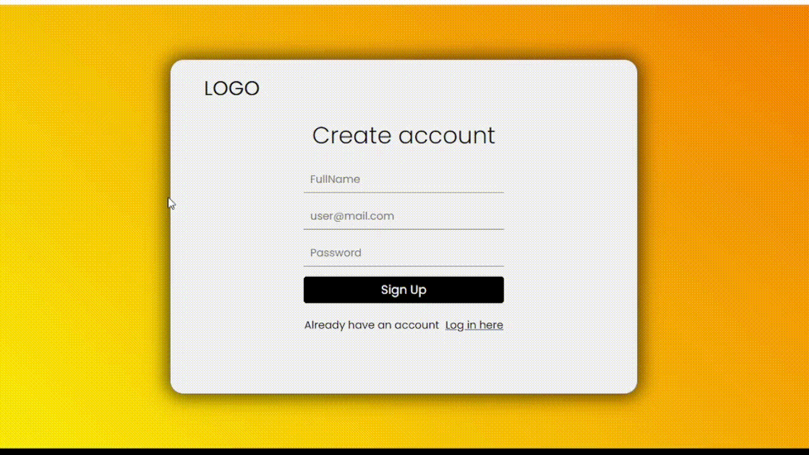

# SignUpProgressBar


On progress

## SignUpProgressBar

SignUpProgressBar is a user-friendly and visually engaging tool for creating a "create account" page with a form filling progress bar. It simplifies the process of designing and implementing a sign-up flow by providing a customizable progress bar that dynamically updates as users fill out the required information.
## Screenshots


### Installation

To run the Minimalist-Form project, please follow these steps:

1. Clone the repository:

   ```shell
   git clone https://github.com/valiyev000/SignUpProgressBar
   ```

2. And run these folder (or open the index.html)
